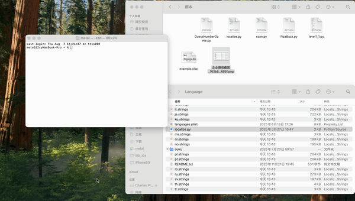

# EasyLocalize
EasyLocalize 是一个用于 iOS 国际化的文本工具，帮助你高效地将 Excel 表格中的文案拼接到现有的 `.strings` 文件中。

EasyLocalize helps you efficiently add localized text in iOS development.



## 使用说明 / How to Use

### 1. 下载 `localize.py` 文件，放到你的 `.strings` 国际化文件所在的文件夹中。
**Download `localize.py` and place it in the folder where your `.strings` localization files are located. You may commit it to your project for future use, but it's not required.**

---

### 2. 打开终端，`cd` 到 `.strings` 所在的文件夹。
**Open the terminal and `cd` into the folder where your `.strings` files are located.**

```bash
cd path/to/your/strings/folder
```

---

### 3. 执行以下命令：
**Run the following command:**

```bash
python localize.py
```

执行后会出现如下提示：  
**After running, you will see the following prompt:**

```
请输入 Excel 文件路径：
```
**Please enter the path to the Excel file:**

---

### 4. 将符合项目中 `example.xlsx` 样式的国际化表格拖入终端，并按下回车键。
**Drag the localization Excel file (following the `example.xlsx` format, you can download `example.xlsx` from project) into the terminal, then press Enter.**

---

### 5. 出现如下提示表示执行成功：
**If you see the following message, it means the operation was successful:**

```
生成并写入 en.strings 成功！
生成并写入 fr.strings 成功！
生成并写入 es.strings 成功！
生成并写入 de.strings 成功！
生成并写入 it.strings 成功！
生成并写入 pt.strings 成功！
生成并写入 ja.strings 成功！
生成并写入 ru.strings 成功！
生成并写入 nl.strings 成功！
生成并写入 ar.strings 成功！
生成并写入 no.strings 成功！
生成并写入 da.strings 成功！
生成并写入 sv.strings 成功！
生成并写入 ko.strings 成功！
生成并写入 fi.strings 成功！

```
---

## License

MIT License
